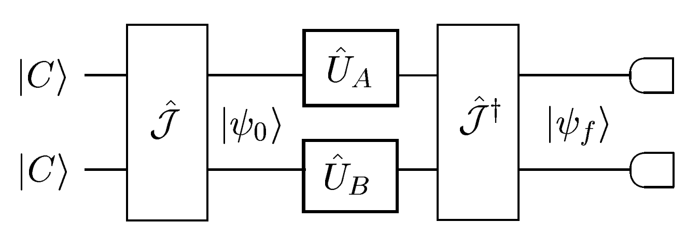
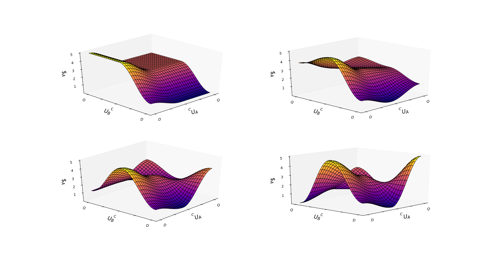

# Quantum-Prisoners-Dilemma
We investigate the quantization of non-zero sum game called Prisoners’ Dilemma.

------

# Introduction:

1.  The introduction of quantum strategies in Prisoner’s dilemma can remove the dilemma as well as ensure absolute reward against any classical strategy.
2.  The classical strategies cooperate |C⟩ and defect |D⟩ are used to represent the game’s quantum state as a vector in the space with |CC⟩ , |CD⟩ , |DC⟩ , and |DD⟩ as bases, the first alphabet in each representing Alice’s move.
3.  To model (any) entanglement between Alice and Bob’s moves, the game starts with a Unitary Transform Ĵ applied to |CC⟩.
4.  Now, Alice and Bob play their strategies which are 2x2 Unitary operators denoted by Û~A~ and Û~B~ respectively.
5.  Finally, to determine the players’ individual pay-off the qubits are forwarded to a measurement consisting of a Unitary operator Ĵ^†^ followed by a state collapse. Final state: |Ѱ~f~⟩ = Ĵ^†^ (Û~A~⊗Û~B~)Ĵ |CC⟩.
6.  Due to intrinsically probabilistic outcomes, we measure the expected payoff, that is $A=rPCC+pPDD+tPDC+sPCD where r,p,t and s are from the standard payoff matrix and the P’s are the measured probabilities of the respective outcome.
7.  The quantum strategies are simulated as a 2-parameter set of Unitary Matrices.
8.  Now we run the game for several settings of , and derive the 𝜙 𝜃 payoff statistics for Alice.

# Circuit:

# Results:

